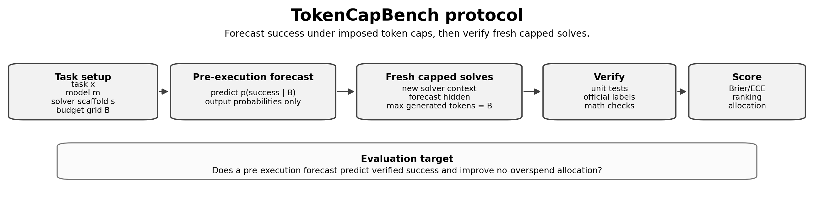

<div align="center">

# TokenCapBench

**Forecasting verified success under token caps**

[](pyproject.toml)
[](LICENSE)
[](paper/)

TokenCapBench evaluates whether a model can forecast its probability of
producing a verifier-passing answer before it is run under a generated-token
budget.

</div>

## Contents

- [Overview](#overview)
- [What Ships](#what-ships)
- [Evidence Scope](#evidence-scope)
- [Public Artifact Notes](#public-artifact-notes)
- [Repository Layout](#repository-layout)
- [Quick Start](#quick-start)
- [Provider Setup](#provider-setup)
- [Preparing Tasks](#preparing-tasks)
- [Metrics](#metrics)
- [Citation](#citation)
- [License](#license)

## Overview

Most benchmarks ask whether a model solves a task at a fixed inference setting.
TokenCapBench asks a deployment-facing question:

> Before running the solver, what probability of verifier-passing success does
> each generated-token cap buy?

For each task, a model first predicts a success-by-budget curve across a hard
budget grid. The harness then launches fresh capped solver calls, verifies each
output with a task-specific verifier, and scores both probability quality and
fixed-budget allocation quality.

```text
task + budget grid
  -> forecast P(success by budget)
  -> fresh capped solver calls
  -> independent verification
  -> calibration, ranking, and allocation metrics
```



TokenCapBench is not raw response-length prediction. The controlled intervention
is the generated-token cap, and the target is verified success under that cap.
Token usage, latency, finish reasons, and provider metadata are logged as
resource-accounting diagnostics.

## What Ships

| Component | Description |
|---|---|
| Forecasting harness | Prompts and runners for collecting per-budget success forecasts before solver execution. |
| Budgeted execution harness | Fresh solver calls under generated-token caps, with run manifests and resource logs. |
| Verification bridges | Deterministic and official-harness-backed verification for math and coding tracks. |
| Metrics | Calibration, Brier score, first-success-budget diagnostics, ranking, regret, and allocation summaries. |
| Frozen artifacts | Compact run summaries, tables, figures, metadata, and release manifests. |
| Validation checks | Schema, evidence-scope, packaging, and hygiene tests for the benchmark release. |

## Evidence Scope

The current release focuses on verifier-backed math and standalone coding, with
scoped extensions for harder coding, editing, and freshness checks.

| Role | Track | Tasks | Models | Verification | Release role |
|---|---|---:|---:|---|---|
| Core | GSM8K + MATH/MATH-500 | 1,000 | 4 | numeric / symbolic checks | main calibration and allocation evidence |
| Core | HumanEval+ + MBPP+ | 542 | 4 | EvalPlus | main calibration and allocation evidence |
| Extension | BigCodeBench-Hard | 148 | 5 | official BigCodeBench package labels | harder standalone coding extension |
| Extension | CanItEdit | 105 | 4 | provided tests | code-editing bridge |
| Appendix | LiveCodeBench-300 | 300 | 2 | official LiveCodeBench labels | freshness check |
| Appendix | Prompt variants | 150 | 2+ | frozen verifier outcomes | forecast stability check |

The release does not claim full production-agent evaluation. In particular, it
does not make official SWE-bench, Docker-agent, OpenHands, or hidden-test
code-editing claims. CanItEdit uses provided tests. Generated-token caps are
measured separately from any hidden reasoning compute exposed by a provider.

## Public Artifact Notes

- [Benchmark card](BENCHMARK_CARD.md) documents intended use, evidence scope,
  limitations, and responsible release notes.
- [Data provenance](DATA_PROVENANCE.md) distinguishes upstream benchmark task
  sources from TokenCapBench-generated forecasts, outcomes, metrics, and
  figures.
- [Reproduction guide](REPRODUCING.md) gives the commands for validating the
  frozen artifacts and rebuilding the release archive.

## Repository Layout

```text
configs/            Experiment, model, source, and budget configs
data/               Raw, processed, and development task files
metadata/           Croissant metadata and release metadata
paper/              Paper assets, figures, tables, bibliography, and PDF
prompts/            Forecast and solver prompt templates
reports/            Generated figures, tables, manifests, and compact run outputs
scripts/            Task prep, execution, scoring, plotting, packaging, and validation
src/                Python package source for the benchmark harness
tests/              Unit, smoke, schema, artifact, and hygiene tests
```

## Quick Start

Create an environment and install the development extras:

```bash
python -m venv .venv
source .venv/bin/activate
pip install -e .[dev]
PYTEST_DISABLE_PLUGIN_AUTOLOAD=1 pytest -q
```

Run the local mock pipeline:

```bash
python scripts/run_forecasts.py --config configs/experiments/pilot.yaml
python scripts/run_budget_grid.py --config configs/experiments/pilot.yaml
python scripts/score_results.py --config configs/experiments/pilot.yaml
python scripts/make_tables.py --config configs/experiments/pilot.yaml
python scripts/make_figures.py --config configs/experiments/pilot.yaml
```

The mock pipeline writes run-level outputs under `reports/runs/<run_id>/`:

```text
forecasts.jsonl
outcomes.jsonl
metrics.json
run_manifest.json
sha256_manifest.json
```

## Provider Setup

The main live-client path uses an OpenAI-compatible chat-completion adapter.
Configure it through environment variables or equivalent experiment-config
fields:

```bash
export OPENAI_COMPATIBLE_BASE_URL="https://provider.example/v1"
export OPENAI_COMPATIBLE_API_KEY="<api-key>"
```

Provider-specific clients should remain isolated in the client layer. Release
claims should describe the evaluation protocol and verifier evidence, not
provider implementation details, unless provider behavior changes the measured
protocol.

## Preparing Tasks

Local toy data:

```bash
python scripts/prepare_tasks.py \
  --source local \
  --input data/dev/sample_tasks.jsonl \
  --output data/processed/pilot.jsonl
```

GSM8K with `datasets` installed:

```bash
python scripts/prepare_tasks.py \
  --source gsm8k \
  --split test \
  --limit 100 \
  --budget-grid 256 512 1024 2048 \
  --output data/processed/gsm8k_test_100.jsonl
```

MATH/MATH-500 with `datasets` installed:

```bash
python scripts/prepare_tasks.py \
  --source math \
  --split test \
  --limit 100 \
  --budget-grid 512 1024 2048 4096 \
  --output data/processed/math_test_100.jsonl
```

Paper-grade verification for EvalPlus, BigCodeBench, LiveCodeBench, SWE-bench,
BFCL, and tau-bench should be delegated to their official harnesses through the
bridge modules.

## Metrics

Each budgeted run record stores:

| Field family | Examples |
|---|---|
| Budget intervention | imposed generated-token cap, cap-hit flag, truncation status |
| Verification | verifier result, verifier metadata, task-specific labels |
| Provider outcome | finish reason, retry count, provider metadata where available |
| Token accounting | prompt, completion, total, and reasoning-token counts where available |
| Runtime accounting | wall-clock timing fields where available |

The main controlled variable is the generated-token budget. Latency and
total-token accounting are intended for resource diagnostics and scheduling
extensions.

## Citation

If you use TokenCapBench, cite the forthcoming benchmark paper described in
[CITATION.cff](CITATION.cff):

```text
TokenCapBench: Forecasting Verified Success Under Token Caps
```

## License

This repository is released under the [MIT License](LICENSE).
